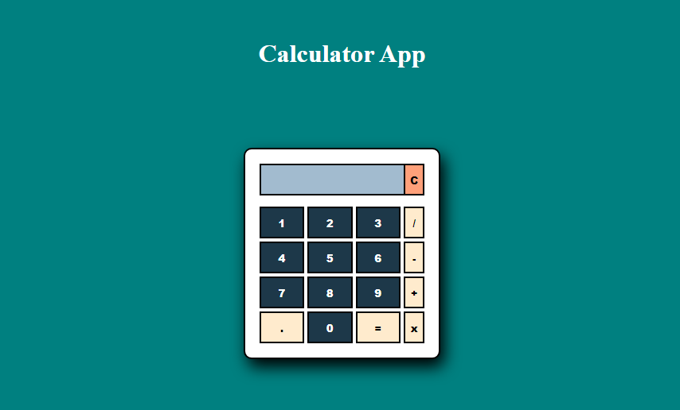

# Basic Calculator App

This is a simple calculator app implemented in JavaScript. It performs basic arithmetic operations such as addition, subtraction, multiplication, and division.

## Features

- Addition: Add two numbers together.
- Subtraction: Subtract one number from another.
- Multiplication: Multiply two numbers.
- Division: Divide one number by another.

## Usage

1. Clone the repository:

`git clone https://github.com/devJames1/calculatorapp.git`

2. Open the `index.html` file in your web browser.

3. Enter the two numbers in the input fields.

4. Select the operation you want to perform using the operation buttons.

5. Click the "=" button to see the result.

## Example

Suppose you want to add two numbers, 5 and 3. Follow these steps:

1. Enter `5+3` in the first input field.

2. Click the "=" button.

The result will be displayed: `8`.

## Contributing

Contributions are welcome! If you find any issues or want to add new features, please submit a pull request. Make sure to follow the existing coding style and write appropriate tests.

## Author

James Okolie

## License

This project is licensed under the [MIT License](LICENSE).
